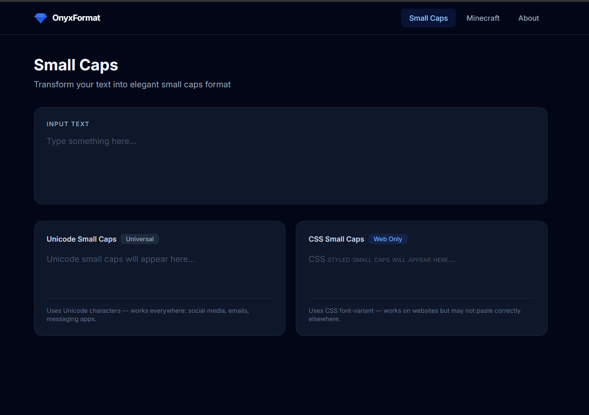

# OnyxFormat

A modern text formatting tool designed for Minecraft server administrators and content creators. OnyxFormat transforms plain text into elegant small caps or vibrant Minecraft color codes through an intuitive and professional interface.

[](https://ptthanh02.github.io/OnyxFormat)
[](LICENSE)



## Features

### Small Caps Converter
- **Unicode Small Caps**: Universal format compatible across all platforms
- **CSS Small Caps**: Web-optimized formatting for seamless website integration
- Real-time preview and one-click copy functionality

### Minecraft Text Formatting
- Comprehensive color palette featuring all 16 standard Minecraft colors
- Custom hex color support with an integrated visual color picker
- Advanced text styling options including bold, italic, underline, strikethrough, and obfuscated text
- Professional formatting presets (e.g., Server Welcome, Error, Success)
- Advanced gradient text generator
- Real-time Minecraft preview demonstrating exact in-game text rendering

## Quick Start

1. **Access the Application**: Visit [https://ptthanh02.github.io/OnyxFormat](https://ptthanh02.github.io/OnyxFormat)
2. **Select a Tool**: Choose your desired formatting utility from the navigation menu
3. **Configure**: Input your text and apply the preferred colors or formatting styles
4. **Export**: Copy the formatted output directly to your clipboard
5. **Deploy**: Paste the result into your Minecraft server configuration, social media, or documentation

## Local Development

To run the project locally for development or testing purposes:

```bash
# Clone the repository
git clone https://github.com/ptthanh02/OnyxFormat.git
cd OnyxFormat

# Start a local development server
python -m http.server 8000
# Alternatively, using Node.js:
npx serve .

# Access the application at http://localhost:8000
```

## Use Cases

- **Minecraft Server Administration**: Design colorful MOTD messages, server announcements, and plugin configurations.
- **Content Creation**: Generate refined small caps typography for social media profiles and official documents.
- **Software Development**: Format text assets for custom Minecraft plugins and server configuration files.

## Contributing

Contributions are highly encouraged. Please review the existing codebase, submit detailed issue reports for bugs or feature requests, and open pull requests for proposed changes.

## License

This project is licensed under the MIT License. For detailed information, please refer to the [LICENSE](LICENSE) file.